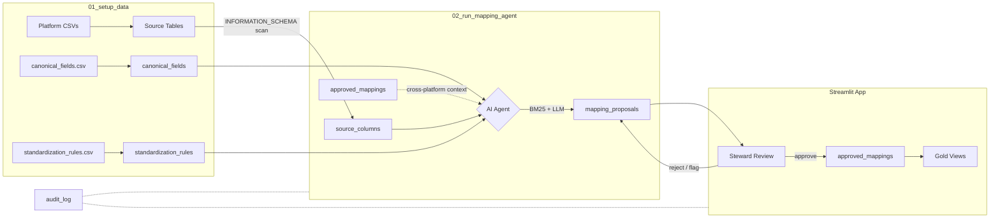

# Column Mapper

Cross-platform column standardization for fund administration data, backed by Delta tables and serverless SQL.

Six source platforms (Alpha Ledger, Summit Books, Capital Track, Trade Core, Realty Ops, Dist Calc) each use different column naming conventions. This project discovers every column, uses an AI agent to propose mappings to a canonical schema, and provides a Streamlit app for data stewards to review, approve, and generate gold views.

## Prerequisites

- Databricks workspace with a serverless SQL warehouse
- Databricks CLI authenticated (`databricks auth login` or a profile in `~/.databrickscfg`)
- [uv](https://docs.astral.sh/uv/) for local development

## Deploy to Databricks

Everything is managed by Databricks Asset Bundles. The deploy script wraps the bundle commands:

```bash
./deploy.sh              # uses the default target
./deploy.sh dev          # uses a named target
```

Or step by step:

```bash
databricks bundle validate
databricks bundle deploy --auto-approve
databricks bundle run column_mapping_setup    # catalog, tables, seed data, permissions
databricks bundle run column_mapper           # start the app
```

The setup job creates the Unity Catalog catalog and schemas, loads seed CSVs, and grants the app's service principal access to the catalog. The app resource in `resources/apps.yml` binds the SQL warehouse with `CAN_USE` permission automatically.

### Run the mapping agent

After the app is deployed and stewards want fresh AI proposals:

```bash
databricks bundle run column_mapping_run_agent
```

## Run locally

```bash
uv run streamlit run app/app.py
```

Requires a Databricks workspace with a serverless SQL warehouse and an authenticated CLI profile.

## Tests

```bash
uv run pytest
```

## Data Flow



## How It Works

### Seed data

`canonical_fields.csv` defines 30 standard column names with data types, business definitions, and domain categories. `standardization_rules.csv` defines 22 abbreviation rules (e.g. `fnd` -> `fund`, `amt` -> `amount`). The setup job loads these into Delta tables and creates one schema per platform.

### AI agent pipeline

For each unmapped column, the agent runs:

1. **Deterministic standardization** -- lowercase, expand abbreviations, enforce snake_case
2. **BM25 search** -- find similar approved mappings and candidate canonical fields
3. **Cross-platform context** -- gather what other platforms call this concept
4. **LLM synthesis** -- produce a recommendation with confidence (0-100) and rationale

### Steward review

Data stewards use the Streamlit app to approve, reject, flag, reassign, or create new canonical entries. Every action is audit-logged.

### Gold views

Approved mappings generate SQL views that rename source columns to canonical names.

## Configuration

All settings live in `config.yaml`. Adding a new platform is one entry under `platforms` plus uploading its CSV.

## Repo layout

```
app/app.py           Streamlit application (steward review UI)
app.yaml             Databricks Apps runtime config (command + env vars)
requirements.txt     App Python dependencies (installed in Databricks Apps container)
data/                Seed CSVs (6 platforms + canonical fields + rules)
notebooks/
  01_setup_data      Create catalog, schemas, tables; load seed CSVs; grant permissions
  02_run_mapping_agent  Discover columns and run AI agent batch
src/column_mapping/
  agent_tools        BM25 search, deterministic standardization, abbreviation rules
  mapping_agent      Agent orchestration (tool pipeline + LLM synthesis)
config.yaml          All configuration (catalog, platforms, agent thresholds, LLM endpoint)
databricks.yml       Bundle configuration (variables, targets)
resources/
  apps.yml           App resource definition (SQL warehouse binding)
  jobs.yml           Serverless job definitions (setup + agent)
deploy.sh            One-command deployment wrapper
```
