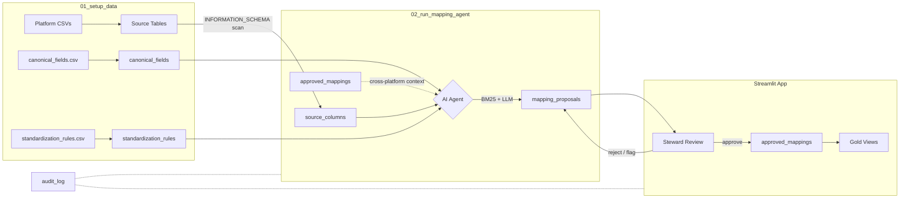

# Column Mapper

Cross-platform column standardization for fund administration data, backed by Delta tables and serverless SQL.

Six source platforms (Alpha Ledger, Summit Books, Capital Track, Trade Core, Realty Ops, Dist Calc) each use different column naming conventions. This project discovers every column, uses an AI agent to propose mappings to a canonical schema, and provides a Streamlit app for data stewards to review, approve, and generate gold views.

## Data Flow



## How Column Rationalization Works

### Step 1 -- Seed reference data

`canonical_fields.csv` defines 30 standard column names with data types, business definitions, and domain categories (Fund, Valuation, Investor, Capital, Fees, Transaction, Security, Position, Reporting, Operations). `standardization_rules.csv` defines 22 abbreviation rules (e.g. `fnd` -> `fund`, `amt` -> `amount`, `txn` -> `transaction`).

Run `01_setup_data` to load these into Delta tables and create the six metadata tables.

### Step 2 -- Load source platform data

The same setup notebook uploads six CSV files into separate Unity Catalog schemas, one per platform:

| Platform | Schema | Table | Columns | Description |
|---|---|---|---|---|
| Alpha Ledger | `alpha_ledger` | `positions` | FND_ID, FUND_NM, NAV_AMT, ... | Fund admin (legacy), UPPER abbreviations |
| Summit Books | `summit_books` | `investors` | fund_id, fund_name, nav_total, ... | Fund admin (next-gen), lowercase |
| Trade Core | `trade_core` | `transactions` | TXN_ID, TXN_DATE, TXN_AMT, ... | Investment operations, UPPER abbreviations |
| Capital Track | `capital_track` | `commitments` | FundCode, FundName, LPCommitment, ... | PE fund admin, PascalCase |
| Realty Ops | `realty_ops` | `properties` | Property_Fund_ID, Fund Name, ... | Real estate, mixed case with spaces |
| Dist Calc | `dist_calc` | `distributions` | WF_Calc_ID, Fund_Ref, Dist_Dt, ... | Distribution waterfalls, underscore prefixes |

### Step 3 -- Discover source columns

`02_run_mapping_agent` scans `INFORMATION_SCHEMA` for every column in every platform schema. Each column is written to the `source_columns` table with a `column_id`, `platform_id`, `source_table`, `column_name`, and `data_type`.

### Step 4 -- AI agent proposes mappings

For each unmapped column, the agent runs a fixed pipeline:

1. **Deterministic standardization** -- lowercase, expand abbreviations (`FND_ID` -> `fund_id`), remove special characters, enforce snake_case.
2. **BM25 search: approved mappings** -- find similar columns that have already been mapped on other platforms.
3. **BM25 search: canonical fields** -- find candidate canonical fields by name, definition, and domain.
4. **Cross-platform context** -- for the top candidates, gather all platforms that already map to them.
5. **LLM synthesis** -- send all context to an LLM (`ai_query`) to produce a recommendation with confidence score (0-100) and rationale.

Each result is written to `mapping_proposals` with status `pending_review`.

### Step 5 -- Steward review

Data stewards open the Streamlit app and work through the Data Mapping tab:

- **Approve** -- accepts the AI suggestion and writes to `approved_mappings`.
- **Reject** -- marks the proposal as rejected.
- **Flag** -- marks for team discussion.
- **Reassign** -- override the AI suggestion and pick a different canonical field.
- **Create and Link** -- if no canonical field fits, create a new one and link in one step.

Every action is recorded in the `audit_log` table.

### Step 6 -- Generate gold views

From the Master File tab, stewards can generate SQL views in the gold schema that rename source columns to their canonical names:

```sql
CREATE OR REPLACE VIEW column_mapping.gold.alpha_ledger__positions AS
SELECT
    `FND_ID` AS `fund_identifier`,
    `FUND_NM` AS `fund_name`,
    `NAV_AMT` AS `net_asset_value`,
    ...
FROM column_mapping.alpha_ledger.positions
```

## Delta Tables

| Table | Purpose |
|---|---|
| `canonical_fields` | 30 standard column definitions (the target schema) |
| `standardization_rules` | Abbreviation expansion rules for deterministic pre-processing |
| `source_columns` | Every column discovered from platform schemas |
| `mapping_proposals` | AI-generated mapping suggestions with confidence and rationale |
| `approved_mappings` | Steward-approved column-to-canonical links |
| `audit_log` | Append-only compliance trail of every action |

## Configuration

All settings live in `config.yaml`:

| Setting | Purpose |
|---|---|
| `databricks.catalog` / `schema` | Unity Catalog location for metadata tables |
| `databricks.warehouse_id` | Serverless SQL warehouse |
| `tables.*` | Names for the six Delta tables |
| `platforms[]` | Source systems (id, name, source_catalog, source_schema) |
| `gold.catalog` / `schema` | Where gold views are created |
| `llm.endpoint` | Model serving endpoint for the batch agent |

Adding a new source platform is one entry under `platforms` plus uploading its data.

## Run locally

```bash
uv run streamlit run app/app.py
```

Requires a Databricks workspace with a serverless SQL warehouse and an authenticated CLI profile.

## Tests

```bash
uv run pytest
```

## Repo layout

```
app/                Streamlit application (steward review UI)
data/               Seed CSVs (6 platforms + canonical fields + rules)
notebooks/
  01_setup_data     Load CSVs into Unity Catalog, create tables
  02_run_mapping_agent  Discover columns and run AI agent
src/column_mapping/
  agent_tools       BM25 search, deterministic standardization, abbreviation rules
  mapping_agent     Agent orchestration (tool pipeline + LLM synthesis)
config.yaml         All configuration
resources/          Databricks Asset Bundle job definitions
```
